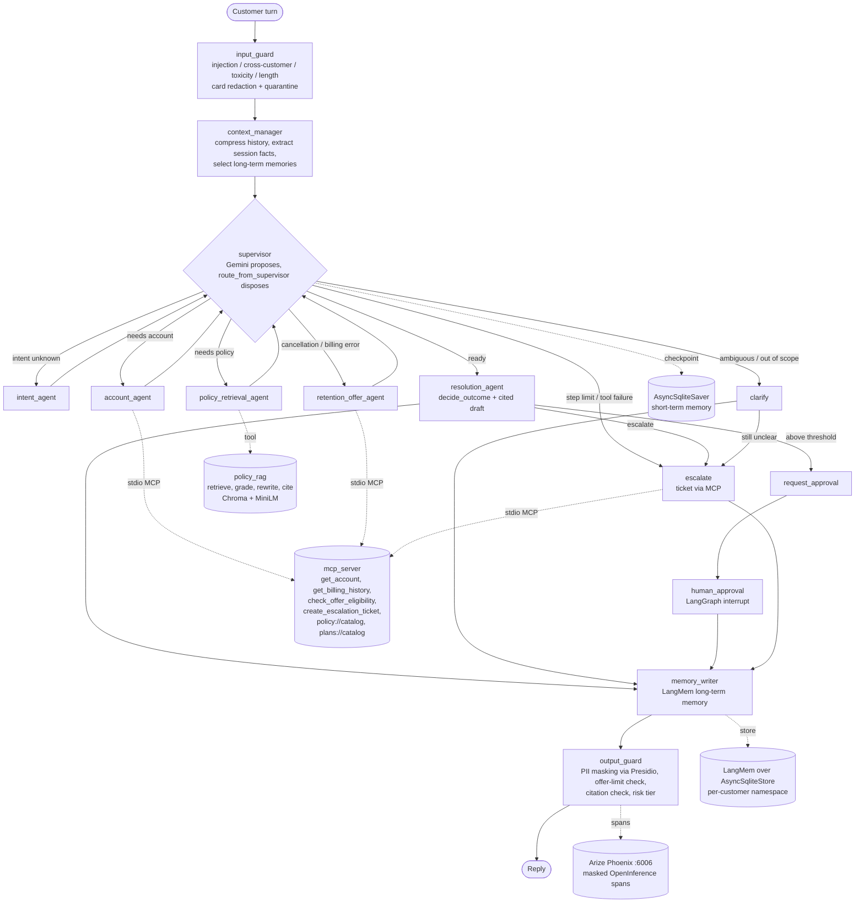

# Customer Service & Retention Copilot (BC-AAIE-HACK-17, Telecom)

A LangGraph multi-agent copilot for telecom customer care. For each customer contact it:
1. classifies the intent;
2. pulls the caller's account and plan through a custom MCP server;
3. retrieves the applicable offer / retention policy with an agentic-RAG tool and cites it;
4. drafts a resolution (resolve / offer / escalate);
5. routes any discount or credit above a threshold to a human approval gate.

It is instrumented with Arize Phoenix, cost/latency governed, guarded (input/output guardrails, audit
trail), documented for governance, and evaluated with DeepEval (Gemini judge) and pytest.
All data is synthetic, and Google Gemini is the only LLM provider.

## Contents
- [Architecture](#architecture)
- [Setup](#setup)
- [Run the copilot](#run-the-copilot)
- [Regenerate all evidence](#regenerate-all-evidence)
- [Open Phoenix](#open-phoenix)
- [Tests](#tests)
- [Streaming API (bonus)](#streaming-api-bonus)
- [Where every artifact lives](#where-every-artifact-lives)
- [Known limitations](#known-limitations)

## Architecture



Key design choices:

| Choice | Where |
|---|---|
| Routing is a pure function of state, so it is unit-testable without an LLM | `src/agents/supervisor.py::route_from_supervisor` |
| Outcomes are decided by rules; the model only drafts wording, with a citation whitelist | `src/agents/resolution_agent.py::decide_outcome` |
| Offer limits are enforced by a deterministic MCP tool, never by the model | `mcp_server/server.py::evaluate_offer` |
| Every node returns a validated Pydantic model | `src/schemas.py` |
| Graph, typed state and checkpointer | `src/graph.py` |

## Setup

Requires Python 3.11+ and pip. No Docker and no external database: SQLite, local Chroma and in-process Phoenix.

```bash
python3.11 -m venv .venv
source .venv/bin/activate
pip install -r requirements.txt          # pinned; resolves cleanly (pip check)
playwright install chromium              # only for the dashboard screenshot
cp .env.example .env                     # then set GOOGLE_API_KEY
```

Setup notes:
- **Gemini model.** `GEMINI_MODEL` / `GEMINI_JUDGE_MODEL` default to `gemini-3.8-flash`. `gemini-2.5-flash`
  returns 404 for new API users. The free tier allows about 20 requests per day per model, so set `GEMINI_RPM`
  and expect graceful fallback to deterministic rules when quota runs out.
- **First run.** The first run downloads the local `all-MiniLM-L6-v2` embedding model.
- **Synthetic data.** The data is committed. To regenerate it: `python -m scripts.generate_synthetic_data`
  (seed 17, deterministic).

## Run the copilot

```bash
python -m src.cli run --input data/sample_contacts.jsonl
```

- Approvals are interactive by default. Use `--auto-approve` or `--auto-reject` for reproducible
  non-interactive runs; those decisions are recorded as `system:` actors in `logs/agent_actions.jsonl`.
- `--no-llm` forces the deterministic rules/templates engine. Without it, a preflight call decides whether
  Gemini is usable.
- Tracing to Phoenix is on by default (`--no-trace` to disable); `--export-traces` writes
  `traces/phoenix_spans.parquet`.
- Results go to `reports/sample_run_results.jsonl`.

Interactive chat as one (synthetic) customer:

```bash
python -m src.cli chat --customer CUST-000397
```

## Regenerate all evidence

```bash
python -m scripts.regenerate_evidence            # deterministic; add --llm to let the agent use Gemini
```

One command, 15 steps, stopping with a nonzero exit at the first failure:

| # | Step | What it does |
|---|---|---|
| 1 | data | synthetic data, only if missing |
| 2 | index | policy index |
| 3 | phoenix | start Phoenix |
| 4 | tools | tool / MCP exercise |
| 5 | contacts | all sample contacts with auto-approve, plus trace export |
| 6 | redteam | red team |
| 7 | eval | traced DeepEval evaluation |
| 8 | tests | pytest |
| 9 | signals | golden signals |
| 10 | dashboard | dashboard |
| 11 | benchmark | optimization benchmark |
| 12 | api | API demo |
| 13 | reconcile | tool reconciliation |
| 14 | pii | PII scan |
| 15 | citations | citation check |

A full run takes about 4-5 minutes; the first run on a fresh clone adds about 1 minute while Phoenix
creates its database. Per-step console output (masked) goes to `logs/regenerate/` and the summary to
`reports/regenerate_summary.json`.

About the eval step's judge:
- The judge is pinned with `EVAL_JUDGE_MODEL` (default `gemini-3.6-flash`) and runs without judge
  "reason" calls to save free-tier quota.
- Judge verdicts are cached in `.cache/eval_judge_cache.sqlite`. When the judge is unreachable, cached
  verdicts are replayed; anything not cached is reported as not run, never scored.
- To judge from scratch:

  ```bash
  python -m scripts.run_eval --judge-model gemini-3.6-flash --metrics hallucination,faithfulness,answer_relevancy
  ```

## Open Phoenix

- **During a run.** `src.cli run`, `scripts.run_eval` and `scripts.regenerate_evidence` start the
  in-process app automatically at http://localhost:6006.
- **Afterwards.** Browse the persisted traces with `python -m src.observability.tracing` (Ctrl-C to stop).
  Projects:

  | Project | Contents |
  |---|---|
  | `retention-copilot` | sample contacts |
  | `retention-copilot-eval` | golden-set eval |
  | `retention-copilot-bench-before` / `-bench-after` | optimization benchmark |

- **Span metadata.** Every span carries `copilot.run_id`, `copilot.session_id` and `copilot.agent`. The
  per-turn `copilot.turn` span also carries the masked customer, intent, outcome and output-risk tier.
- **Classification.** Spans are classified as thinking (LLM), acting (AGENT/CHAIN/GUARDRAIL) or tool
  (TOOL/RETRIEVER).

## Tests

```bash
python -m pytest -q          # 104 tests, no API key needed (Gemini disabled or stubbed)
```

| Test file | What it covers |
|---|---|
| `tests/test_routing.py` | conditional edges, clarify / escalate, over-threshold → human approval, stub-LLM proposals |
| `tests/test_loops.py` | step limit and recursion limit end in escalation, RAG loop bounded |
| `tests/test_tool_contracts.py` | every tool's input/output schema and error paths |
| `tests/test_memory_persistence.py` | cross-process recall; writes `logs/memory_test.log` |
| `tests/test_guardrails.py` | guardrails, output-risk tiers, failure-analysis regressions |
| `tests/test_context.py` | isolation, quarantine and compression |
| `tests/test_provider_policy.py` | Gemini-only provider policy, pinned requirements |

## Streaming API (bonus)

```bash
uvicorn src.api.app:app --port 8000
curl -N -X POST localhost:8000/v1/contacts/stream -H 'X-Customer-Id: CUST-000397' \
     -H 'Content-Type: application/json' -d '{"message": "Half off or I am leaving"}'
```

- Server-Sent Events: one `node` event per graph node, then `resolution`, or `approval_required` when a
  human must decide.
- `POST /v1/sessions/{id}/approval` with `{"approved": true, "approver": "name"}` resumes the paused thread.
- Code: `src/api/app.py`. Demo that drives all of this over HTTP (including the approval round-trip and a
  cross-customer 403): `python -m scripts.api_demo`, which writes `logs/api_demo.log`.

## Where every artifact lives

| Criterion | Evidence (code → artifact) |
|---|---|
| **AC-01** intent, account/plan, cited policy | `src/agents/intent_agent.py`, `src/agents/account_agent.py`, `src/tools/rag_tool.py` → `reports/sample_run_results.jsonl` (intent, citations), `logs/tool_calls.jsonl`, `traces/phoenix_spans.parquet` |
| **AC-02** compliant offer within limits, over-limit blocked | `mcp_server/server.py::evaluate_offer`, `src/agents/retention_offer_agent.py` → `logs/agent_actions.jsonl` (offer_blocked / offer_proposed with policy_ref), `tests/test_tool_contracts.py` |
| **AC-03** resolve / offer / escalate; above-threshold credit or discount to a human | `src/agents/resolution_agent.py::decide_outcome`, `src/agents/human_loop.py::human_approval` → `logs/agent_actions.jsonl` (approval_requested / approval_granted / approval_denied), `docs/output-risk.md` |
| **AC-04** right capability; ambiguous / out-of-scope clarified or escalated | `src/agents/supervisor.py::route_from_supervisor`, `src/agents/human_loop.py::clarify` → `reports/eval_report.json` (intent and action accuracy), `tests/test_routing.py` |
| **AC-05** in-session context and cross-session recall | `src/context/`, `src/memory/` → `logs/memory_test.log`, `tests/test_memory_persistence.py` |
| **AC-06** injection and cross-customer refused; no sensitive data exposed | `src/guardrails/`, `src/context/quarantine.py`, `mcp_server/auth.py` → `reports/redteam_results.json`, `scripts/check_pii_leaks.py` |
| **AC-07** machine-generated tool log; names reconcile with code | `src/tools/logging_middleware.py` → `logs/tool_calls.jsonl`, `logs/mcp_transcript.jsonl`, `reports/tool_reconciliation.json` (`scripts/reconcile_tools.py`) |
| **AC-08** at least 3 real failures with run_id + span_id / log record, root cause, fix | `scripts/find_failures.py` → `docs/failure-analysis.md`, frozen evidence `evidence/pre_fix/` |
| **AC-09** Phoenix-derived golden signals and cost/latency dashboard | `scripts/golden_signals.py`, `scripts/dashboard.py` → `reports/golden_signals.json`, `reports/dashboard.png` (Phoenix screenshot), `reports/dashboard_data.csv`, `reports/dashboard_charts.png`, `reports/optimization_note.md` |
| **AC-10** guardrails in the I/O path; audit trail | `src/guardrails/nodes.py` (first and last graph nodes), `src/audit/audit_middleware.py` → `logs/agent_actions.jsonl` |
| **AC-11** governance pack, each claim citing a control | `docs/risk-register.md`, `docs/model-card.md`, `docs/compliance.md`, `docs/output-risk.md`, checked by `scripts/verify_citations.py` |
| **AC-12** DeepEval report and agent tests | `scripts/run_eval.py` → `reports/eval_report.json`, `traces/eval_spans.parquet`; `tests/test_routing.py`, `tests/test_loops.py`, `tests/test_tool_contracts.py` |
| **NFR-01** no secrets | `.env.example`, `.gitignore` (covers `.env`), `src/config.py` |
| **NFR-02** single run command and single regeneration command | `src/cli.py`, `scripts/regenerate_evidence.py`, committed inputs `data/sample_contacts.jsonl`, `data/golden_set.jsonl` |
| **NFR-03** untrusted text quarantined | `src/context/quarantine.py::untrusted_prompt`, `tests/test_context.py` |
| **NFR-04** async, timeouts, retries, graceful degradation | `src/resilience.py::resilient_call`, `src/llm.py::llm_preflight`, `tests/test_loops.py` |
| **NFR-05** synthetic data, masked everywhere | `scripts/generate_synthetic_data.py`, `src/guardrails/pii.py::mask_obj`, `scripts/check_pii_leaks.py` |
| **NFR-06** evidence produced by committed code | `scripts/regenerate_evidence.py` → `reports/regenerate_summary.json`; citations checked by `scripts/verify_citations.py` |

Other docs: `docs/failure-analysis.md`, `docs/risk-register.md`, `docs/model-card.md`,
`docs/compliance.md`, `docs/output-risk.md`.

## Known limitations

- **Evidence engine.** The committed evidence was generated in deterministic mode (rules/templates, no
  Gemini calls) because the configured Gemini models were unusable for the development key.
  - Quality numbers reflect the deterministic engine and controls, not Gemini's language quality.
  - The traces contain no LLM spans, so token cost is unmeasured.
- **Judge metrics.** Free-tier Gemini quota allowed only a partial LLM-as-judge run: hallucination judged
  on 2 of 18 golden cases (both pass), with faithfulness and relevancy not run.
  `reports/eval_report.json` records exactly what was and was not judged and contains no invented scores
  (`docs/failure-analysis.md` F5).
- **Rules coverage.** Rule-based intent and injection detection only cover the vocabulary and patterns they
  were given. New phrasings can be misrouted to `clarify` or pass the input guard; harm is contained by the
  deterministic policy check and approval gate.
- **Simulated identity and approvals.** Caller authentication is simulated (the contact's customer ID).
  Scripted approvals in reproducible runs are recorded as `system:` actors, not people.
- **Heuristics.** The churn-risk score is a hand-written formula over synthetic features, and memory recall
  uses a small local embedding model.
- **Compliance.** See `docs/compliance.md` for gaps: consent/notice, breach notification, AI literacy,
  retention schedule. This is a prototype, not legal advice.
